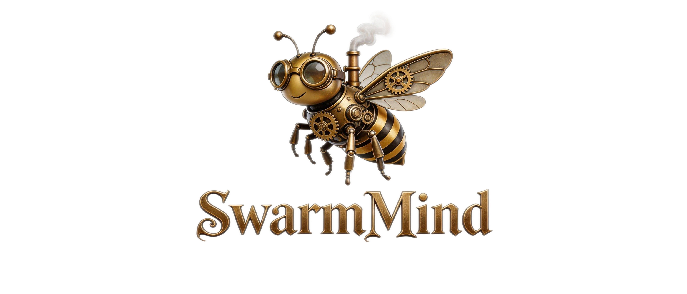

<div align="center">



# 🐝 SwarmMind  
### 当多个 AI 思考时，智能自然涌现。
### AI Agents 的群体智能引擎。

### [English](./README.md) | [中文文档](./README_CN.md)

</div>

> 多个 AI 思维，一个集体智能。  
> 让 AI 代理共同思考、相互挑战、收敛至更优解决方案。

SwarmMind 是一个开源的**群体智能引擎**，由多代理认知博弈和智能路由驱动。传统 AI 系统依赖**单一模型生成答案**。SwarmMind 探索一种新范式：**智能从多个 AI 代理通过认知对抗和智能交接共同思考中涌现**。

受**蚁群、蜂群、鸟群和人类团队**等自然群体系统启发，SwarmMind 以**结构化认知博弈**编排多个 AI 代理，让他们协作、辩论、挑战、智能转移控制权，最终通过民主投票收敛至最优解决方案。

不再是单一 AI 一次响应，SwarmMind 创造了**一个认知群体，共同思考、博弈、路由、决策**。


## 📖 目录

- [概述](#概述)
- [什么是群体智能](#什么是群体智能)
- [愿景](#愿景)
- [核心特性](#核心特性)
- [架构](#架构)
- [创新亮点](#创新亮点)
- [认知博弈](#认知博弈)
- [交接与路由](#交接与路由)
- [安装](#安装)
- [快速开始](#快速开始)
- [使用示例](#使用示例)
- [API 参考](#api-参考)
- [应用场景](#应用场景)
- [路线图](#路线图)
- [贡献](#贡献)
- [许可证](#许可证)


## 概述

SwarmMind 是一个开源的**群体智能引擎**，用于多代理 AI 系统。

当前大多数 AI 系统依赖**单一模型生成答案**。

SwarmMind 探索一种不同的范式：

> 智能从多个 AI 代理通过认知对抗和智能路由共同思考中涌现。

灵感来自自然群体系统：

- 蚁群  
- 蜂群  
- 鸟群  
- 人类团队  

SwarmMind 编排 AI 代理：

- 协作进行复杂推理
- 相互挑战假设
- 进行认知博弈
- 通过交接智能转移控制权
- 基于角色和上下文路由
- 通过民主投票达成共识

结果是**一个认知群体共同思考、进行认知博弈、智能路由、并收敛到一起**。


## 什么是群体智能

群体智能描述了**许多简单代理本地交互产生强大集体智能**的过程。

自然界的例子：

| 系统 | 行为 |
|------|------|
| 蚁群 | 发现最短路径 |
| 蜂群 | 集体决策 |
| 鸟群 | 协调移动 |
| 人类团队 | 协作解决问题 |

SwarmMind 将这一原理应用于 **AI 代理系统**，独特地关注**认知对抗、智能交接和民主收敛**。


## 愿景

现代 AI 模型很强大，但很**孤立**。

每个模型独立工作，没有真正的智力对抗或协调。

SwarmMind 正在构建**认知群体智能引擎**，使代理能够：

- 进行多视角推理
- 挑战彼此的认知盲区
- 通过交接机制智能转移控制权
- 基于角色专业化路由任务
- 民主投票决定立场
- 达成超越单一模型能力的共识

我们的使命：

> AI 的未来不是单一模型——而是**众多思维共同思考、进行认知博弈、智能路由、收敛至更优智能**。


## 核心特性

### 🧠 多代理认知博弈

与简单的多代理协作不同，SwarmMind 代理进行**结构化认知博弈**：

- 多视角分析同一问题
- 代理之间的直接挑战
- 论证的强度评分
- 立场上的民主投票

### 🔄 七阶段认知流水线

SwarmMind 执行**七阶段认知流水线**：

```
初始化 → 研究 → 认知博弈 → 辩论 → 批评 → 综合 → 共识 → 完成
```

每个阶段有特定代理角色活跃，确保全面的认知处理。

### 🧩 模块化代理角色

代理可以拥有专业认知角色：

| 代理 | 职责 | 视角 |
|------|------|------|
| 研究员代理 | 生成想法 | 经验型 |
| 批评者代理 | 挑战假设 | 批判型 |
| 规划者代理 | 组织推理 | 逻辑型 |
| 编码者代理 | 实现解决方案 | 务实型 |
| 评审者代理 | 评估结果 | 分析型 |
| 综合者代理 | 整合洞察 | 创造型 |
| 协调者代理 | 引导讨论 | 平衡型 |

### 🔀 智能交接与路由

受多代理编排启发，SwarmMind 具备**智能交接机制**：

- **HandoffManager**：追踪代理之间的控制转移
- **SwarmRouter**：基于角色和上下文路由任务
- **ContextVariable**：跨代理执行的共享状态
- 基于角色的路由：研究员 → 规划者 → 批评者 → 评审者 → 综合者

### 🧠 双轨记忆系统

代理共享带有双轨的协作记忆系统：

- **提案轨**：想法和建议
- **批评轨**：挑战和弱点
- **推理轨**：认知移动和分析
- **共识轨**：投票结果和最终立场

### ⚖️ 内置辩论引擎

结构化辩论能力：

- 立场追踪（支持/反对/中立）
- 交叉质询支持
- 轮次辩论管理
- 立场强度评分

### 🎯 多种共识方法

灵活的共识机制：

- 多数投票
- 加权共识
- 分层投票
- 认知博弈投票（民主对抗）

### 🗳️ 认知博弈引擎

独特的认知博弈功能：

- 6 种认知视角（逻辑、创造、分析、务实、批判、经验）
- 多轮认知对抗
- 代理之间的挑战定向
- 40 代理民主投票模拟
- 视角分布分析


## 架构

SwarmMind 遵循**分布式认知群体架构与智能路由**：

```
                用户
                 │
                 ▼
           Swarm 引擎
                 │
     ┌───────────┼───────────┐
     ▼           ▼           ▼
 代理 A       代理 B       代理 C
 研究员        批评者       规划者
     │           │           │
     └─────── 认知博弈 ───────┘
                 │
     ┌───────────┼───────────┐
     ▼           ▼           ▼
  辩论          综合        共识
     │           │            │
     └─────── 交接管理器 ───────┘
                 │
     ┌───────────┼───────────┐
     ▼           ▼           ▼
  路由器      上下文变量      网络
```

核心组件：

- **Swarm 引擎** — 编排认知阶段和执行流程
- **代理** — 具有专业认知角色的自主推理单元
- **群体记忆** — 双轨共享上下文和历史
- **认知博弈引擎** — 多代理认知对抗引擎
- **HandoffManager** — 追踪和执行控制转移
- **SwarmRouter** — 基于角色的智能任务路由
- **ContextVariable** — 共享状态管理
- **辩论引擎** — 结构化论点交换
- **共识引擎** — 民主聚合和投票


## 创新亮点

SwarmMind 引入了几项原创创新：

### 1. 认知博弈作为核心机制

与将多代理视为简单协作的系统不同，SwarmMind 将**认知对抗置于核心**：

- 代理不只是协作——他们**相互挑战**
- 每个假设都可以被批评者代理挑战
- 论证有**强度评分**影响投票
- 认知博弈通过民主投票产生**获胜者**

### 2. 七阶段认知流水线

执行流程被结构化为七个不同阶段：

```
初始化 → 研究 → 认知博弈 → 辩论 → 批评 → 综合 → 共识 → 完成
```

这确保在得出结论之前进行**全面的认知处理**。

### 3. 智能交接与基于角色的路由

受多代理编排启发，SwarmMind 实现**智能交接机制**：

- **交接原因**：完成、升级、转移、协作、共识
- **角色网络**：基于角色关系连接代理
- **SwarmRouter**：基于当前角色和上下文的自动路由
- **ContextVariable**：交接期间传递的共享状态

### 4. 六种认知视角

代理从不同的认知视角运作：

| 视角 | 特点 | 适用于 |
|------|------|--------|
| 逻辑 | 系统推理 | 架构、规划 |
| 创造 | 新奇组合 | 头脑风暴、设计 |
| 分析 | 细节审查 | 调试、评审 |
| 务实 | 实践导向 | 实现 |
| 批判 | 挑战思维 | 风险识别 |
| 经验 | 证据驱动 | 研究、验证 |

### 5. 民主收敛

最终决策通过**民主收敛**产生：

- 多轮认知对抗
- 代理对立场投票（模拟 40 代理投票）
- 强度评分影响最终结果
- 共识不是妥协——是**赢得的优越性**

### 6. 基于角色的认知专业化

每个角色都有**认知档案**：

- 研究员 → 经验视角 → 想法生成
- 批评者 → 批判视角 → 弱点识别
- 规划者 → 逻辑视角 → 结构创建
- 综合者 → 创造视角 → 整合
- 评审者 → 分析视角 → 评估


## 认知博弈

SwarmMind 的认知博弈引擎实现**结构化智力对抗**：

### 工作原理

1. **视角分配**：每个代理获得一个认知视角
2. **初始移动**：代理从各自视角提出开场论点
3. **挑战阶段**：批评者挑战其他代理的假设
4. **多轮对抗**：多轮认知交流
5. **民主投票**：40 个模拟代理对立场投票
6. **获胜者宣布**：最强认知立场获胜

### 认知视角

- **逻辑**：系统的、分步推理
- **创造**：新奇组合和意外角度
- **分析**：深入检查细节
- **务实**：实用的、可实现的解决方案
- **批判**：挑战假设和发现缺陷
- **经验**：基于证据、数据驱动的方法


## 交接与路由

SwarmMind 具备**智能交接和路由机制**：

### 交接原因

- **COMPLETE（完成）**：任务完成，返回控制权
- **ESCALATE（升级）**：需要更高权限的问题
- **TRANSFER（转移）**：交接给管道中的下一个代理
- **COLLABORATE（协作）**：请求协作
- **CONSENSUS（共识）**：达成集体决策

### 角色网络

代理按角色网络连接：

```
研究员 → 规划者, 批评者
批评者 → 评审者, 研究员
规划者 → 编码者, 研究员
编码者 → 评审者, 规划者
评审者 → 综合者, 批评者
综合者 → 协调者, 评审者
协调者 → 研究员, 规划者
```

### SwarmRouter

基于以下进行智能路由：

- 当前代理角色
- 任务上下文
- 交接历史
- 共识状态


## 安装

克隆仓库：

```bash
git clone https://github.com/Yuan-ManX/SwarmMind.git
cd SwarmMind
```

安装依赖：

```bash
pip install -r requirements.txt
```

开发模式安装：

```bash
pip install -e .
```


## 快速开始

运行简单的群体推理实验：

```bash
python run_swarm.py
```


## 使用示例

创建具有认知博弈和交接的 AI 代理群体：

```python
from swarmmind import Swarm

swarm = Swarm(
    agents=5,
    roles=["researcher", "critic", "planner", "coder", "reviewer"]
)

result = swarm.solve(
    task="设计一个高效的语言模型训练策略"
)

print(result.solution)
```

访问交接统计：

```python
if result.handoff_stats:
    print(f"总交接次数: {result.handoff_stats['total_handoffs']}")
    print(f"参与代理数: {result.handoff_stats['unique_agents']}")
```

带交接调优的高级配置：

```python
from swarmmind import SwarmConfig, AgentRole
from swarmmind.core import SwarmEngine
from swarmmind.handoff import HandoffManager, HandoffReason

config = SwarmConfig(
    name="研究群体",
    max_rounds=5,
    agents_per_role=2,
    roles=[
        AgentRole.RESEARCHER,
        AgentRole.CRITIC,
        AgentRole.PLANNER,
        AgentRole.REVIEWER,
    ],
    consensus_threshold=0.75,
    enable_debate=True,
)

engine = SwarmEngine(config)
result = engine.solve("分析量子计算对加密技术的影响")
```


## API 参考

### Swarm 类

```python
from swarmmind import Swarm

swarm = Swarm(
    agents=5,              # 代理总数
    roles=["researcher", "critic", "planner"],
    model_name="gpt-4",   # 使用的模型
    max_rounds=5          # 最大推理轮次
)

result = swarm.solve(task="你的任务")
```

### SwarmConfig

```python
from swarmmind import SwarmConfig, AgentRole

config = SwarmConfig(
    name="自定义群体",
    max_rounds=10,
    agents_per_role=2,
    roles=[AgentRole.RESEARCHER, AgentRole.CRITIC],
    model_name="gpt-4",
    temperature=0.7,
    consensus_threshold=0.7,
    enable_debate=True,
    enable_memory=True,
    memory_size=1000,
)
```

### 代理角色

可用角色及其认知视角：

- `AgentRole.RESEARCHER` — 生成想法，经验视角
- `AgentRole.CRITIC` — 挑战假设，批判视角
- `AgentRole.PLANNER` — 组织推理，逻辑视角
- `AgentRole.CODER` — 实现解决方案，务实视角
- `AgentRole.REVIEWER` — 评估结果，分析视角
- `AgentRole.SYNTHESIZER` — 整合洞察，创造视角
- `AgentRole.FACILITATOR` — 引导讨论，平衡视角

### 交接 API

```python
from swarmmind.handoff import HandoffManager, HandoffReason, ContextVariable, SwarmRouter

# 交接管理器
hm = HandoffManager()
hm.register_agent("agent_1")
hm.connect_agents("agent_1", "agent_2")
hm.execute_handoff("agent_1", "agent_2", HandoffReason.TRANSFER, message="任务转移")
stats = hm.analyze_handoff_patterns()

# 上下文变量
ctx = ContextVariable()
ctx.set("task", "analysis")
ctx.update({"key": "value"})

# Swarm 路由器
router = SwarmRouter(hm)
next_agent = router.auto_route_by_role("researcher", ctx)
```

### 认知博弈引擎

```python
from swarmmind import CognitiveGameEngine, CognitivePerspective, CognitiveMove

game = CognitiveGameEngine(max_rounds=5, voting_agents=40)
game.start_game("我们应该采用 Transformer 架构吗？")

move = CognitiveMove(
    agent_id="agent_1",
    perspective=CognitivePerspective.CRITICAL,
    content="Transformer 注意力机制对于简单任务可能是过度设计",
    strength=0.8,
    round_number=1
)
game.add_move(move)

analysis = game.analyze_game()
```

### 结果对象

```python
result = swarm.solve(task="你的任务")

# 基本结果
print(result.task)
print(result.solution)
print(result.rounds_completed)
print(result.execution_time)

# 共识
print(result.consensus.final_position)
print(result.consensus.confidence)

# 认知博弈结果
if result.cognitive_game_result:
    print(result.cognitive_game_result['total_moves'])
    print(result.cognitive_game_result['perspective_distribution'])

# 交接统计
if result.handoff_stats:
    print(result.handoff_stats['total_handoffs'])
    print(result.handoff_stats['unique_agents'])

# 代理信息
print(result.agents)
print(result.memory_stats)
```


## 应用场景

### 自主 AI 研究

- 通过认知对抗生成研究想法
- 多视角设计实验
- 批评者和综合者分析结果

### 协作编码

- 逻辑规划者设计架构
- 务实编码者编写代码
- 分析评审者审查实现
- 批判挑战者检测 bug

### 复杂问题解决

- 多视角分析规划
- 认知博弈策略
- 创造综合系统设计

### 创意协作

- 创造视角故事创作
- 认知对抗头脑风暴
- 多视角投票设计概念


## 路线图

计划功能：

- [ ] LLM 集成层（OpenAI、Anthropic、本地模型）
- [ ] 群体可视化仪表板
- [ ] 分布式群体执行
- [ ] 持久化和检查点
- [ ] 基于 WebSocket 的实时进度
- [ ] 群体知识图谱
- [ ] 自主研究管道
- [ ] 多群体协调
- [ ] 认知视角定制
- [ ] 交互式辩论界面


## 贡献

SwarmMind 欢迎以下贡献：

- 添加新的认知视角
- 改进代理协调算法
- 构建可视化工具
- 优化性能
- 编写教程

欢迎提交 **Issue** 或 **Pull Request**。


## 许可证

MIT 许可证 - 参见 [LICENSE](LICENSE) 了解详情。


## Star History

如果喜欢这个项目，请 ⭐ 给仓库加星。

<p align="center">

<a href="https://star-history.com/#Yuan-ManX/SwarmMind&Date">
 
</a>

</p>
</div>
